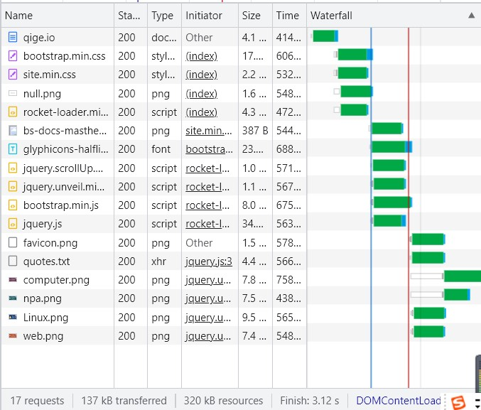
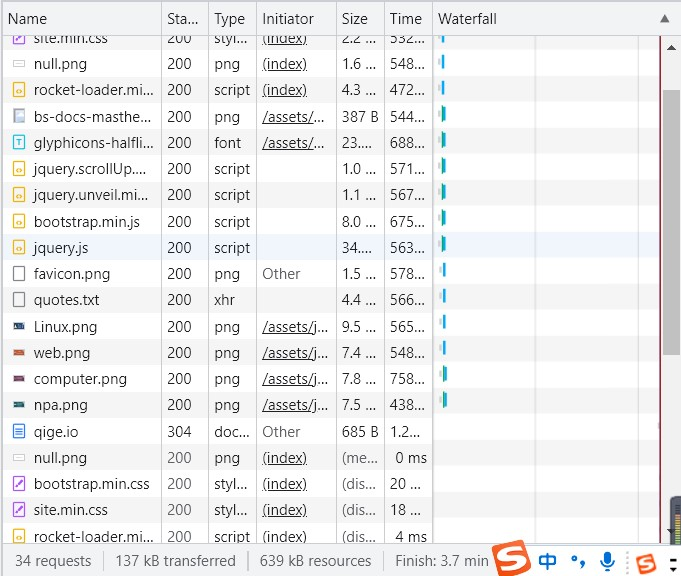

## 验证性试验

### ipconfig

 ```
 以太网适配器 VMware Network Adapter VMnet8:
 
    连接特定的 DNS 后缀 . . . . . . . :
    描述. . . . . . . . . . . . . . . : VMware Virtual Ethernet Adapter for VMnet8
    物理地址. . . . . . . . . . . . . : 00-50-56-C0-00-08
    DHCP 已启用 . . . . . . . . . . . : 否
    自动配置已启用. . . . . . . . . . : 是
    本地链接 IPv6 地址. . . . . . . . : fe80::2e28:f5ef:562a:d9c4%19(首选)
    IPv4 地址 . . . . . . . . . . . . : 192.168.221.1(首选)
    子网掩码  . . . . . . . . . . . . : 255.255.255.0
    默认网关. . . . . . . . . . . . . :
    DHCPv6 IAID . . . . . . . . . . . : 738218070
    DHCPv6 客户端 DUID  . . . . . . . : 00-01-00-01-24-D0-94-A7-E4-54-E8-1D-02-59
    DNS 服务器  . . . . . . . . . . . : fec0:0:0:ffff::1%1
                                        fec0:0:0:ffff::2%1
                                        fec0:0:0:ffff::3%1
    TCPIP 上的 NetBIOS  . . . . . . . : 已启用
 ```


>子网掩码与IP地址结构相同，是32位二进制数，其中网络号部分全为“1”和主机号部分全为“0”。利用子网掩码可以判断两主机是否中同一子网中。若两台主机的IP地址分别与它们的子网掩码相 “*与*” 后的结果相同，则说明这两台主机在同一子网中，所以**我的计算机和旁边的计算机没有处于同一子网**


### ping

```
正在 Ping 218.70.34.236 具有 32 字节的数据:
来自 218.70.34.236 的回复: 字节=32 时间=39ms TTL=50
来自 218.70.34.236 的回复: 字节=32 时间=41ms TTL=50
来自 218.70.34.236 的回复: 字节=32 时间=83ms TTL=50
来自 218.70.34.236 的回复: 字节=32 时间=52ms TTL=50

218.70.34.236 的 Ping 统计信息:
    数据包: 已发送 = 4，已接收 = 4，丢失 = 0 (0% 丢失)，
往返行程的估计时间(以毫秒为单位):
    最短 = 39ms，最长 = 83ms，平均 = 53ms
```


- TTL（time to live）:生存时间，指示了IP数据包可以经过最大的路由器数量，当一个ip数据包每经过一个路由器时，该TTL的值就会减1，当经过的路由器个数超过TTL的值时，该IP数据包就会被路由器抛弃，这样就可以避免数据包在网络中无限传输
- 时间：表示电脑到Internet的重庆交通大学 Web 服务器网站的时间，网络延时的意思！


>选项:
>    -t             Ping 指定的主机，直到停止。
>    -a             将地址解析为主机名。
>    -n count       要发送的回显请求数。
>    -l size        发送缓冲区大小。
>    -r count       记录计数跃点的路由(仅适用于 IPv4)。
>    -s count       计数跃点的时间戳(仅适用于 IPv4)。


> ping -n 3 218.70.34.236
>
>正在 Ping 218.70.34.236 具有 32 字节的数据:
>来自 218.70.34.236 的回复: 字节=32 时间=57ms TTL=50
>来自 218.70.34.236 的回复: 字节=32 时间=52ms TTL=50
>来自 218.70.34.236 的回复: 字节=32 时间=39ms TTL=50
>
>218.70.34.236 的 Ping 统计信息:
>    数据包: 已发送 = 3，已接收 = 3，丢失 = 0 (0% 丢失)，
>往返行程的估计时间(以毫秒为单位):
>    最短 = 39ms，最长 = 57ms，平均 = 49ms


### tracert

```
 tracert www.baidu.com

通过最多 30 个跃点跟踪
到 www.a.shifen.com [183.232.231.172] 的路由:

  1     2 ms     5 ms     2 ms  192.168.164.186
  2     *        *        *     请求超时。
  3     *        *        *     请求超时。
  4     *        *        *     请求超时。
  5    67 ms    44 ms    60 ms  ptr.cq.chinamobile.com [211.139.50.220]
  6    43 ms    35 ms    33 ms  ptr.cq.chinamobile.com [218.207.38.161]
  7    58 ms     *        *     ptr.cq.chinamobile.com [218.207.38.157]
  8     *        *        *     请求超时。
  9     *        *        *     请求超时。
 10     *        *        *     请求超时。
 11     *        *       97 ms  120.241.49.198
 12     *        *        *     请求超时。
 13    88 ms    93 ms    86 ms  183.232.231.172
```


>`tracert` 能告诉我们路径上的节点以及大致的延迟等信息，那么它背后的原理是什么?

通过向目标发送不同IP生存时间 (TTL) 值的“Internet控制消息协议 (ICMP)”回应数据包，Tracert诊断程序确定到目标所采取的路由

>在以上两个实作中，如果你留意路径中的节点，你会发现无论是访问百度还是棋歌教学网，路径中的第一跳都是相同的，甚至你应该发现似乎前几个节点都是相同的，你的解释是什么?

第一条相同是因为目标主机不在子网内，需要跳出子网，那就要先经过网关，前几条相同是因为跳出网关之后依旧 要经过上一级之后才在资源子网中寻找可以到达目标主机的路径

>在追踪过程中，你可能会看到路径中某些节点显示为 * 号，这是发生了什么？

经过结点有回应，但是返回数据包未在规定时间内到达本机，超时


### ARP

```
arp -a
接口: 192.168.164.5 --- 0x12
  Internet 地址         物理地址              类型
  192.168.164.186       b6-c1-03-99-4c-59     动态
  192.168.164.255       ff-ff-ff-ff-ff-ff     静态
  224.0.0.22            01-00-5e-00-00-16     静态
  224.0.0.251           01-00-5e-00-00-fb     静态
  224.0.0.252           01-00-5e-00-00-fc     静态
  239.255.255.250       01-00-5e-7f-ff-fa     静态
  255.255.255.255       ff-ff-ff-ff-ff-ff     静态
```


```
arp /?
显示和修改地址解析协议(ARP)使用的“IP 到物理”地址转换表。
ARP -s inet_addr eth_addr [if_addr]
ARP -d inet_addr [if_addr]
ARP -a [inet_addr] [-N if_addr] [-v]

  -a            通过询问当前协议数据，显示当前 ARP 项。
                如果指定 inet_addr，则只显示指定计算机
                的 IP 地址和物理地址。如果不止一个网络
                接口使用 ARP，则显示每个 ARP 表的项。
  -g            与 -a 相同。
  -v            在详细模式下显示当前 ARP 项。所有无效项
                和环回接口上的项都将显示。
  inet_addr     指定 Internet 地址。
  -N if_addr    显示 if_addr 指定的网络接口的 ARP 项。
  -d            删除 inet_addr 指定的主机。inet_addr 可
                以是通配符 *，以删除所有主机。
  -s            添加主机并且将 Internet 地址 inet_addr
                与物理地址 eth_addr 相关联。物理地址是用
                连字符分隔的 6 个十六进制字节。该项是永久的。
  eth_addr      指定物理地址。
  if_addr       如果存在，此项指定地址转换表应修改的接口
                的 Internet 地址。如果不存在，则使用第一
                个适用的接口。
```


>你可能会在实作三的操作中得到 "ARP 项添加失败: 请求的操作需要提升" 这样的信息，表示命令没能执行成功，你该如何解决？

可能是因为权限不够，以管理员的身份运行cmd


### DHCP

ipconfig/release 会使计算机断网，ipconfig/renew可以使计算机恢复网络。


>在Windows系统下，如果由于某种原因计算机不能获取 DHCP 服务器的配置数据，那么Windows将会根据某种算法自动配置为 169.254.x.x 这样的 IP 地址。显然，这样的 IP 以及相关的配置信息是不能让我们真正接入 Internet 的，为什么？既然不能接入 Internet，那么Winodws系统采用这样的方案有什么意义？

自动配置的IP地址和信息只是短暂性的解决计算机不能获取 DHCP 服务器的配置数据的问题，要真正的接入Internet还是得本身计算机的正确IP地址

### netstat

```
ftp                21/tcp                           #FTP. control
ssh                22/tcp                           #SSH Remote Login Protocol
telnet             23/tcp
smtp               25/tcp    mail                   #Simple Mail Transfer Protocol
```


```
netstat -an

活动连接

  协议  本地地址          外部地址        状态
  TCP    0.0.0.0:80             0.0.0.0:0              LISTENING
  TCP    0.0.0.0:135            0.0.0.0:0              LISTENING
  TCP    0.0.0.0:443            0.0.0.0:0              LISTENING
  TCP    0.0.0.0:445            0.0.0.0:0              LISTENING
  TCP    0.0.0.0:902            0.0.0.0:0              LISTENING
```

### DNS

```
ftp                21/tcp                           #FTP. control
ssh                22/tcp                           #SSH Remote Login Protocol
telnet             23/tcp
smtp               25/tcp    mail                   #Simple Mail Transfer Protocol
```

```

    记录名称. . . . . . . : ns2.epsiloncdn.net
    记录类型. . . . . . . : 1
    生存时间. . . . . . . : 1900
    数据长度. . . . . . . : 4
    部分. . . . . . . . . : 其他
    A (主机)记录  . . . . : 72.21.80.6


    记录名称. . . . . . . : ns3.epsiloncdn.net
    记录类型. . . . . . . : 1
    生存时间. . . . . . . : 1900
    数据长度. . . . . . . : 4
    部分. . . . . . . . . : 其他
    A (主机)记录  . . . . : 192.229.254.5
```

```
ipconfig /flushdns

Windows IP 配置

已成功刷新 DNS 解析缓存。
```

```
ipconfig /flushdns

Windows IP 配置

已成功刷新 DNS 解析缓存。
PS C:\Users\dell> nslookup qige.io
DNS request timed out.
    timeout was 2 seconds.
服务器:  UnKnown
Address:  61.128.128.68

DNS request timed out.
    timeout was 2 seconds.
DNS request timed out.
    timeout was 2 seconds.
DNS request timed out.
    timeout was 2 seconds.
DNS request timed out.
    timeout was 2 seconds.
*** 请求 UnKnown 超时
```

>上面秘籍中我们提到了使用插件或自己修改 `hosts` 文件来屏蔽广告，思考一下这种方式为何能过滤广告？如果某些广告拦截失效，那么是什么原因？你应该怎样进行分析从而能够成功屏蔽它？

修改hosts文件可以让广告重定位到一个地址，使之无法访问，达到广告拦截目的。

### cache

>打开 Chrome 或 Firefox 浏览器，访问 https://qige.io ，接下来敲 `F12` 键 或 `Ctrl + Shift + I` 组合键打开开发者工具，选择 `Network` 面板后刷新页面，你会在开发者工具底部看到加载该页面花费的时间。请进一步查看哪些文件被 cache了，哪些没有



>接下来仍在 `Network` 面板，选择 `Disable cache` 选项框，表明当前不使用 cache，页面数据全部来自于 Internet，刷新页面，再次在开发者工具底部查看加载该页面花费的时间。你可比对与有 cache 时的加载速度差异。




## Wireshark 实验

### 数据链路层

>你会发现 Wireshark 展现给我们的帧中没有校验字段，请了解一下原因。

Wireshark 抓包前，在物理层网卡已经去掉了一些之前几层加的东西，比如前导同步码，FCS等等，之后利用校验码CRC校验，正确时才会进行下一步操作，因此，抓包软件抓到的是去掉前导同步码、FCS之外的数据，没有校验字段


```
ping qige.io

正在 Ping qige.io [2606:4700:3033::6815:272e] 具有 32 字节的数据:
来自 2606:4700:3033::6815:272e 的回复: 时间=259ms
来自 2606:4700:3033::6815:272e 的回复: 时间=267ms
来自 2606:4700:3033::6815:272e 的回复: 时间=261ms
来自 2606:4700:3033::6815:272e 的回复: 时间=255ms

2606:4700:3033::6815:272e 的 Ping 统计信息:
    数据包: 已发送 = 4，已接收 = 4，丢失 = 0 (0% 丢失)，
往返行程的估计时间(以毫秒为单位):
    最短 = 255ms，最长 = 267ms，平均 = 260ms
```

MAC 就是该主机的

```
ping www.cqjtu.edu.cn

正在 Ping www.cqjtu.edu.cn [2001:da8:c801:99::102] 具有 32 字节的数据:
来自 2001:da8:c801:99::102 的回复: 时间=50ms
来自 2001:da8:c801:99::102 的回复: 时间=59ms
来自 2001:da8:c801:99::102 的回复: 时间=47ms
来自 2001:da8:c801:99::102 的回复: 时间=46ms

2001:da8:c801:99::102 的 Ping 统计信息:
    数据包: 已发送 = 4，已接收 = 4，丢失 = 0 (0% 丢失)，
往返行程的估计时间(以毫秒为单位):
    最短 = 46ms，最长 = 59ms，平均 = 50ms
```

目的 MAC 是网关的


>
>通过以上的实验，你会发现：
>
>1. 访问本子网的计算机时，目的 MAC 就是该主机的
>2. 访问非本子网的计算机时，目的 MAC 是网关的
>
>请问原因是什么？

代理ARP原理：对于没有配置缺省网关的计算机要和其他网络中的计算机实现通信，网关收到源计算机的ARP请求会使用自己的MAC地址与目标计算机的IP地址对源计算机进行应答，访问非子网IP时是通过路由器访问的，路由器再把发出去，目标IP收到请求后，再通过路由器端口IP返回去，那么ARP解析将会得到网关的MAC

### 掌握 ARP 解析过程

```
为防止干扰，先使用 arp -d * 命令清空 arp 缓存
ping 你旁边的计算机（同一子网），同时用 Wireshark 抓这些包（可 arp 过滤），查看 ARP 请求的格式以及请求的内容，注意观察该请求的目的 MAC 地址是什么。再查看一下该请求的回应，注意观察该回应的源 MAC 和目的 MAC 地址是什么。
再次使用 arp -d * 命令清空 arp 缓存
然后 ping qige.io （或者本子网外的主机都可以），同时用 Wireshark 抓这些包（可 arp 过滤）。查看这次 ARP 请求的是什么，注意观察该请求是谁在回应。
```

>通过以上的实验，你应该会发现，
>
>1. ARP 请求都是使用广播方式发送的
>2. 如果访问的是本子网的 IP，那么 ARP 解析将直接得到该 IP 对应的 MAC；如果访问的非本子网的 IP， 那么 ARP 解析将得到网关的 MAC。
>
>请问为什么？

代理ARP原理：对于没有配置缺省网关的计算机要和其他网络中的计算机实现通信，网关收到源计算机的ARP请求会使用自己的MAC地址与目标计算机的IP地址对源计算机进行应答，访问非子网IP时是通过路由器访问的，路由器再把发出去，目标IP收到请求后，再通过路由器端口IP返回去，那么ARP解析将会得到网关的MAC

### 网络层

#### 实作一 熟悉 IP 包结构

​    0100 .... = Version: 4
​    .... 0101 = Header Length: 20 bytes (5)
​    Total Length: 82
​    Time to Live: 48
​    Protocol: UDP (17)

>为提高效率，我们应该让 IP 的头部尽可能的精简。但在如此珍贵的 IP 头部你会发现既有头部长度字段，也有总长度字段。请问为什么？

头部长度是来表明该包头部的长度，可以使得接收端计算出报头在何处结束及从何处开始读数据。总长度是为了接收方的网络层了解到传输的数据包含哪些，如果没有该部分，当数据链路层在传输时，对数据进行了填充，对应的网络层不会把填充的部分给去掉。

#### 实作二 IP 包的分段与重组

>分段与重组是一个耗费资源的操作，特别是当分段由传送路径上的节点即路由器来完成的时候，所以 IPv6 已经不允许分段了。那么 IPv6 中，如果路由器遇到了一个大数据包该怎么办？

因为在 IPv6中分段只能在源与目的地上执行，不能在路由器上进行。因此当数据包过大时，路由器就会直接丢弃该数据包包，并向发送端发回一个"分组太大"的ICMP差错报文，之后发送端就会使用较小长度的IP数据报重发数据，所以路由器会直接丢弃再通知发送端进行重传

#### 实作三 考察 TTL 事件

>在 IPv4 中，TTL 虽然定义为生命期即 Time To Live，但现实中我们都以跳数/节点数进行设置。如果你收到一个包，其 TTL 的值为 50，那么可以推断这个包从源点到你之间有多少跳？

由ICMP 回显应答的 TTL 字段值等于128减去TTL返回值，跳数则为128-50=78跳。

### 传输层

#### 实作一 熟悉 TCP 和 UDP 段结构

```
Transmission Control Protocol, Src Port: 50810, Dst Port: 443, Seq: 212, Ack: 2437, Len: 158
    Source Port: 50810
    Destination Port: 443
    [Stream index: 127]
    [Conversation completeness: Complete, WITH_DATA (47)]
    [TCP Segment Len: 158]
    Sequence Number: 212    (relative sequence number)
    Sequence Number (raw): 403531706
    [Next Sequence Number: 370    (relative sequence number)]
    Acknowledgment Number: 2437    (relative ack number)
    Acknowledgment number (raw): 2002374058
    0101 .... = Header Length: 20 bytes (5)
    Flags: 0x018 (PSH, ACK)
    Window: 513
    [Calculated window size: 131328]
    [Window size scaling factor: 256]
    Checksum: 0xfde1 [unverified]
    [Checksum Status: Unverified]
    Urgent Pointer: 0
    [Timestamps]
    [SEQ/ACK analysis]
    TCP payload (158 bytes)
```

```
User Datagram Protocol, Src Port: 50258, Dst Port: 8130
    Source Port: 50258
    Destination Port: 8130
    Length: 48
    Checksum: 0xfbd2 [unverified]
    [Checksum Status: Unverified]
    [Stream index: 1]
    [Timestamps]
    UDP payload (40 bytes)
```

>由上大家可以看到 UDP 的头部比 TCP 简单得多，但两者都有源和目的端口号。请问源和目的端口号用来干什么？

源端口来表示发送终端的某个应用程序，目的端口来表示接收终端的某个应用程序。

#### 实作二 分析 TCP 建立和释放连接

>去掉 `Follow TCP Stream`，即不跟踪一个 TCP 流，你可能会看到访问 `qige.io` 时我们建立的连接有多个。请思考为什么会有多个连接？作用是什么？

有多个连接是因为有些图片资源比较大，需要提前加载。如果等用户访问到时再加载，会导致图片显示过慢，不能满足需求

>问题二:我们上面提到了释放连接需要四次挥手，有时你可能会抓到只有三次挥手。原因是什么？

wireshark自动将中间的请求合并了

### 应用层

#### 实作一 了解 DNS 解析

可了解一下 DNS 查询和应答的相关字段的含义

```
QR：查询或者应答的标志。0表示这是一个查询报文，1表示这是一个应答报文

Opcode：定义查询和应答的类型。0表示标准查询，1表示反向查询（由IP地址获得主机域名），2表示请求服务器状态

AA：授权应答标志。仅由应答报文使用。1表示域名服务器是授权服务器

TC：截断标志。仅当DNS报文使用UDP服务时使用。因为UDP数据报有长度限制，所以过长的DNS报文将被截断。1表示DNS报文超过512字节，并被截断

RD：递归查询标志。1表示执行递归查询，即如果目标DNS服务器无法解析某个主机名，则它将向其他DNS服务器继续查询，如此递归，直到获得结果并把该结果返回给客户端。0表示执行迭代查询，即如果目标DNS服务器无法解析某个主机名，则它将自己知道的其他DNS服务器的IP地址返回给客户端，以供客户端参考

RA：允许递归标志。仅由应答报文使用，1表示DNS服务器支持递归查询
```


>问题:你可能会发现对同一个站点，我们发出的 DNS 解析请求不止一个，思考一下是什么原因？

是因为一个站点可能会有多个ip与之对应


#### 实作二 了解 HTTP 的请求和应答

```
377291	2413.896865	192.168.164.5	120.232.27.226	HTTP	108	POST /cgi-bin/httpconn?htcmd=0x6ff0082&uin=3109017205 HTTP/1.1 
```

```
Hypertext Transfer Protocol
    POST /cgi-bin/httpconn?htcmd=0x6ff0082&uin=3109017205 HTTP/1.1\r\n
    Accept: */*\r\n
    Connection:Keep-Alive\r\n
    User-Agent: Mozilla/5.0 (compatible; MSIE 10.0; Windows NT 6.2)\r\n
    Host: 120.232.27.226:8080\r\n
    Pragma: no-cache\r\n
    Content-Length: 54\r\n
    \r\n
    [Full request URI: http://120.232.27.226:8080/cgi-bin/httpconn?htcmd=0x6ff0082&uin=3109017205]
    [HTTP request 41/41]
    [Prev request in frame: 365778]
    [Response in frame: 377340]
    File Data: 54 bytes
    Data (54 bytes)
    
    
Accept：浏览器可接受的MIME类型。
Accept-Charset：浏览器可接受的字符集。
Accept-Encoding：浏览器能够进行解码的数据编码方式，比如gzip。
Accept-Language：浏览器所希望的语言种类，当服务器能够提供一种以上的语言版本时要用到。
Authorization：授权信息，通常出现在对服务器发送的WWW-Authenticate头的应答中。
Connection：表示是否需要持久连接。如果Servlet看到这里的值为“Keep-Alive”，或者看到请求使用的是HTTP1.1（HTTP 1.1默认进行持久连接），它就可以利用持久连接的优点，当页面包含多个元素时（例如Applet，图片），显著地减少下载所需要的时间。
Content-Length：表示请求消息正文的长度。
Cookie：设置cookie,这是最重要的请求头信息之一
```

```
200
状态码 200 OK 表明请求已经成功. 默认情况下状态码为200的响应可以被缓存。

304
HTTP 304 未改变说明无需再次传输请求的内容，也就是说可以使用缓存的内容。这通常是在一些安全的方法（safe），例如GET 或HEAD 或在请求中附带了头部信息： If-None-Match 或If-Modified-Since。

404
状态码 404 Not Found 代表客户端错误，指的是服务器端无法找到所请求的资源。返回该响应的链接通常称为坏链（broken link）或死链（dead link），它们会导向链接出错处理(link rot)页面。

405
状态码 405 Method Not Allowed 表明服务器禁止了使用当前 HTTP 方法的请求。
```

>刷新一次 qige.io 网站的页面同时进行抓包，你会发现不少的 `304` 代码的应答，这是所请求的对象没有更改的意思，让浏览器使用本地缓存的内容即可。那么服务器为什么会回答 `304` 应答而不是常见的 `200` 应答？

因为浏览器会先在本地检查一次，是否有更改，再在请求头中标注相应的信息，发给服务器。服务器再返回相应的应答代码。
